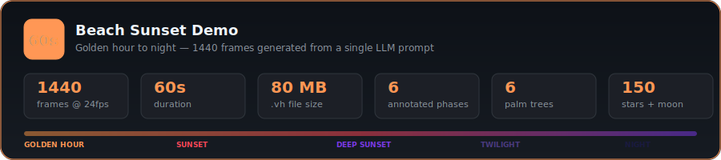
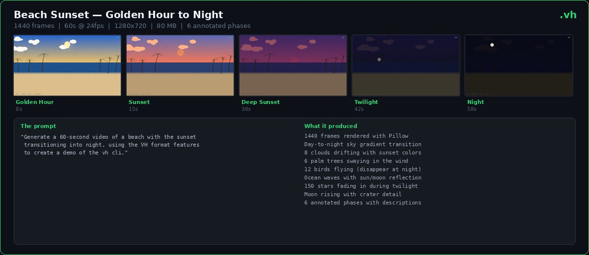
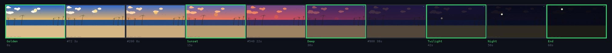
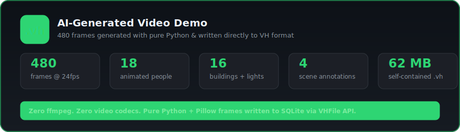
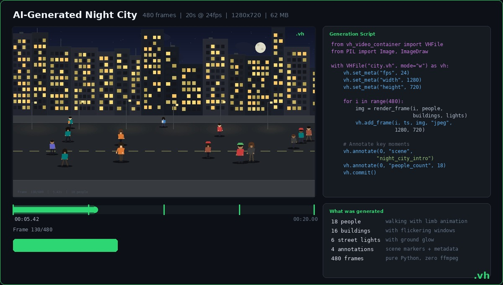
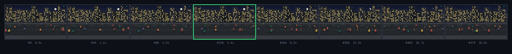
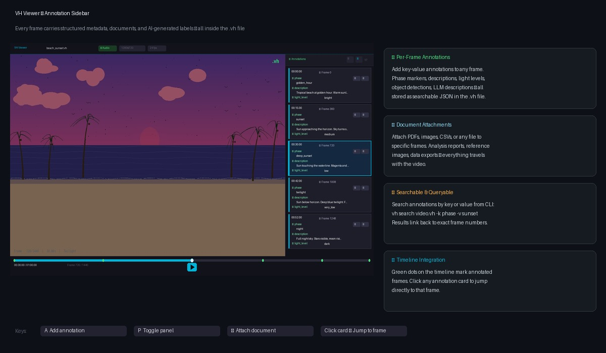
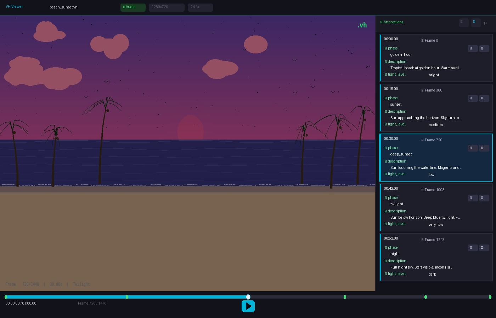
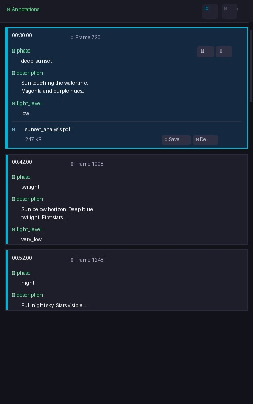

# VH Format

**A video container built for AI, not for humans.**

VH is a video container format that stores every frame as an individually addressable image inside a SQLite database. Unlike traditional video formats (MP4, MKV, WebM) that require sequential decoding through a codec pipeline, VH gives you **O(1) random access to any frame** — the exact access pattern that AI/ML workloads need.

<p align="center">
  
</p>

---

## See It In Action

These videos were **generated entirely by an AI agent** (Claude Code) from a single prompt each — no human code, no ffmpeg, no video codecs. The AI wrote the full rendering pipeline and assembled everything into `.vh` files using the library's own API. Every frame is individually addressable, annotated, and queryable.

### Beach Sunset — 60 seconds, golden hour to night

<p align="center">
  
</p>

<p align="center">
  
</p>

<p align="center">
  
</p>

<details>
<summary><strong>The prompt</strong></summary>

This was the exact, unedited prompt given to [Claude Code](https://claude.ai/code):

```
Generate a 60-second video of a beach with the sunset transitioning into night,
using the VH format features to create a demo of the vh cli.
```

From this single sentence, the AI produced:
- A full rendering engine with sky gradient interpolation across 5 color stops
- Sun with glow, descent animation, and water reflection
- 8 clouds that change color as the sun sets (white to orange to purple to dark)
- 6 palm trees with trunk curvature, frond droop physics, and wind sway
- 12 birds in V-formation that disappear at nightfall
- Ocean with 6 wave layers, foam line, and shore animation
- 150 stars that fade in during twilight with individual twinkle rates
- Moon that rises with crater detail and water reflection
- 6 annotated phase markers (golden_hour, sunset, deep_sunset, twilight, night, night_end)
- Per-phase descriptions and light level metadata

**1440 frames. 80 MB. One prompt. Zero human code.**

</details>

<details>
<summary><strong>Reproduce it yourself</strong></summary>

```bash
pip install vh-video-container Pillow
python examples/generate_beach_sunset.py

# Play it
vh viewer beach_sunset.vh

# Inspect it
vh info beach_sunset.vh

# Search annotated phases
vh search beach_sunset.vh -k phase
vh search beach_sunset.vh -k phase -v night

# Extract a frame
vh extract beach_sunset.vh -f 720 -o deep_sunset.jpg
```

Or give the same prompt to any LLM with access to `vh-video-container` and see what it creates.

</details>

> **Download:** [beach_sunset.mp4](docs/beach_sunset.mp4) (4.5 MB) — exported from the 80 MB `.vh` file with `vh export`

### Night City — 20 seconds, 18 animated people

<p align="center">
  
</p>

<p align="center">
  
</p>

<p align="center">
  
</p>

<details>
<summary><strong>The prompt</strong></summary>

```
Generate a slightly longer video with images of people
```

The AI built an urban night scene with 16 buildings (flickering windows, antennas), 6 street lights with ground glow, and 18 walking people — each with unique skin tone, clothing, walking animation with arm/leg physics, and depth-sorted rendering. 480 frames, 62 MB.

</details>

> **Download:** [night_city.mp4](docs/night_city.mp4) (981 KB) — exported from the 62 MB `.vh` file with `vh export`

> **Full scripts:** [`examples/generate_beach_sunset.py`](examples/generate_beach_sunset.py) | [`examples/generate_people.py`](examples/generate_people.py)

### Converting VH to MP4

Need a standard MP4 for sharing or playback? A single command converts any `.vh` file:

```bash
vh export video.vh -o output.mp4
```

The MP4 is dramatically smaller because H.264 applies inter-frame compression — exactly what VH deliberately avoids for random access. This is the expected tradeoff:

| File | VH Size | MP4 Size | Ratio |
|------|---------|----------|-------|
| Beach Sunset (60s, 1440 frames) | 80 MB | 4.5 MB | 18x smaller |
| Night City (20s, 480 frames) | 62 MB | 981 KB | 63x smaller |

**VH is for working with video** (AI analysis, frame extraction, annotation, random access). **MP4 is for watching video** (streaming, sharing, playback). Use `vh export` when you're done working and need to share the result.

### Annotation Sidebar & Document Attachments

The built-in viewer includes a rich annotation sidebar where you can attach structured metadata, documents, and AI-generated labels to any frame — all stored inside the `.vh` file.

<p align="center">
  
</p>

<p align="center">
  
</p>

**What the sidebar does:**

- **Per-frame annotations** — Add key-value pairs to any frame: scene phases, object detections, LLM descriptions, quality scores. Stored as searchable JSON directly in the `.vh` database.
- **Document attachments** — Attach PDFs, images, CSVs, or any file to a specific frame. Analysis reports, reference images, raw data — everything travels with the video in a single file.
- **Edit & delete** — Each annotation has inline edit and delete buttons. Modify values or remove entries without leaving the viewer.
- **Timeline markers** — Green dots on the timeline show which frames have annotations. Click any card in the sidebar to jump directly to that frame.
- **CLI search** — Query annotations from the command line without opening the viewer:

```bash
# Find all annotated phases
vh search video.vh -k phase

# Find frames labeled as "sunset"
vh search video.vh -k phase -v sunset

# Add an annotation from CLI
vh annotate video.vh -f 720 -k scene -v "deep sunset over ocean"
```

<details>
<summary><strong>Sidebar close-up</strong></summary>

<p align="center">
  
</p>

Each annotation card shows the timestamp, frame number, all key-value pairs with edit/delete controls, and any attached documents with save/delete options. The currently displayed frame's card is highlighted with an accent border.

</details>

For AI pipelines, this means your video, its labels, its analysis results, and its supporting documents are **one portable file** — no folder structures, no sidecar JSONs, no separate databases.

### Import Images from Any Source

Turn any collection of images into a VH video — photos from a camera, AI-generated images from DALL-E / Midjourney / Stable Diffusion, screenshots, medical scans, satellite imagery, or anything else.

```bash
# Directory of images → VH video
vh import-images ./photos/ -o album.vh --fps 24

# Slideshow with 3 seconds per image
vh import-images ./ai-generated/ -o slideshow.vh --duration 3

# Resize all images to 1080p and tag with source filenames
vh import-images ./renders/ -o output.vh --resize 1920x1080 --annotate-source

# Single image
vh import-images photo.jpg -o single.vh

# Then play, annotate, search, or export like any VH file
vh viewer output.vh
vh export output.vh -o output.mp4
```

**Supported formats:** JPG, PNG, WebP, BMP, TIFF, GIF. Identical consecutive images are automatically deduplicated.

**The workflow:**
1. Generate or collect images from **any source** (AI models, cameras, scripts, APIs)
2. `vh import-images` assembles them into a `.vh` file with frame-level random access
3. Annotate, attach documents, search, analyze with AI, or export to MP4

This makes VH the bridge between **image generation** and **video analysis** — regardless of where the images come from.

### AI Video Generation

Generate videos directly from text prompts or images using AI models — no external tools, no manual pipeline. VH supports multiple generation backends through a pluggable architecture:

| Backend | Type | Quality | Speed | Best For |
|---------|------|---------|-------|----------|
| **SVD** (Stable Video Diffusion) | Local GPU | Good — abstract/artistic motion | ~2 min/chain | Quick prototypes, artistic videos, offline use |
| **Kling AI** | Cloud API | Excellent — photorealistic, cinematic | ~30-60s/generation | Realistic scenes, human characters, professional quality |

#### Quick Start: SVD (local GPU)

**Prerequisites:**
- NVIDIA GPU with **8GB+ VRAM** (tested on RTX 3070)
- CUDA toolkit and compatible NVIDIA drivers
- ffmpeg installed (`apt install ffmpeg` or `brew install ffmpeg`)

**Setup:**
```bash
# 1. Install vh-video-container with SVD dependencies
#    (automatically installs: torch, diffusers, transformers, accelerate, safetensors, Pillow)
pip install vh-video-container[generate-svd]

# 2. Generate a video from a text prompt
vh generate "A calm ocean with waves gently rolling onto shore" \
  -o ocean.vh --backend svd --width 512 --height 320 --seed 42

# 3. Generate a longer video with chain generation (15 chains × 14 frames = 30s)
vh generate "A calm ocean with waves gently rolling onto shore" \
  -o ocean_30s.vh --backend svd --chains 15 --width 512 --height 320 --seed 42

# 4. Image-to-video: animate an existing image
vh generate --image photo.jpg -o animated.vh --backend svd --num-frames 25

# 5. Play the result
vh viewer ocean.vh
```

SVD uses SDXL-Turbo to generate a conditioning image from text, then Stable Video Diffusion to animate it. Optimized for 8GB VRAM GPUs with sequential CPU offloading and float16 precision. The first run downloads ~10GB of model weights (cached for subsequent runs).

#### Quick Start: Kling AI (cloud API)

**Prerequisites:**
- Kling AI API account — **[get your keys here](https://klingai.com/global/dev)**
- ffmpeg installed (`apt install ffmpeg` or `brew install ffmpeg`)
- No GPU required — video is generated in the cloud

**Setup:**
```bash
# 1. Install vh-video-container with Kling AI dependencies
#    (automatically installs: PyJWT, requests, Pillow)
pip install vh-video-container[generate-kling]

# 2. Set your API credentials (from https://klingai.com/global/dev)
export KLING_ACCESS_KEY=your_access_key
export KLING_SECRET_KEY=your_secret_key

# 3. Generate cinematic video with realistic humans and environments
vh generate "A woman walking along a tropical beach at sunset, cinematic lighting" \
  -o scene.vh --backend kling --model kling-v2-master --mode pro --duration 10

# 4. Animate a reference image
vh generate "Camera slowly zooming in" \
  --image reference.jpg -o animated.vh --backend kling --duration 5

# 5. Chain multiple generations for longer videos
vh generate "A bustling city street at night with neon lights" \
  -o city.vh --backend kling --mode pro --duration 10 --chains 3 \
  --aspect-ratio 16:9 --negative-prompt "blurry, low quality"

# 6. Play the result
vh viewer scene.vh
```

Kling AI produces photorealistic video with complex scenes, human characters, and cinematic camera movements. Supports up to 1080p (pro mode), 30fps, and 10-second segments that can be chained for longer videos. Kling API usage is billed per generation — check [Kling pricing](https://klingai.com/global/dev) for details.

#### Adding New Backends

The generation system is built on a pluggable backend architecture. Adding a new backend (Runway, Pika, etc.) requires only:

1. Create `vh_video_container/generate/your_backend.py` implementing `GenerateBackend`
2. Register it in `vh_video_container/generate/__init__.py`

```python
from vh_video_container.generate import get_backend, list_backends

# List available backends
print(list_backends())  # ['svd', 'kling']

# Use programmatically
backend = get_backend('kling', access_key='...', secret_key='...')
result = backend.generate(GenerateRequest(prompt="A sunset over mountains", num_frames=150))
```

---

## Installation

```bash
pip install vh-video-container
```

For AI video generation, install the backend you need:

```bash
# SVD — local GPU generation (requires CUDA GPU with 8GB+ VRAM)
pip install vh-video-container[generate-svd]

# Kling AI — cloud API generation (no GPU required)
pip install vh-video-container[generate-kling]
```

After installing, the `vh` CLI is available globally:

```bash
vh info video.vh
vh convert input.mp4 output.vh
vh play video.vh
vh generate "A sunset over the ocean" -o sunset.vh --backend kling
```

And the Python library can be imported directly:

```python
from vh_video_container import VHFile, VHStream
from vh_video_container.generate import get_backend
```

### Requirements

- **Python 3.8+**
- **ffmpeg / ffprobe** — required for video conversion, audio extraction, and playback
- **tkinter** — required for the viewer (`apt install python3-tk` on Debian/Ubuntu)

## Why VH Exists

Modern AI pipelines that work with video — object detection, scene classification, action recognition, multimodal LLMs — share a common pattern: they need to **read individual frames as images**. The standard approach is:

1. Open video with ffmpeg/OpenCV
2. Seek to a position (slow, imprecise)
3. Decode the frame (CPU-intensive)
4. Convert to PIL/numpy (another copy)
5. Feed to the model

This is fundamentally wasteful. Video codecs are designed for **sequential playback**, not random access. Seeking to frame 5000 in an H.264 stream may require decoding hundreds of frames from the nearest keyframe. For AI workloads that sample frames, jump around, or process in parallel — this is the bottleneck.

**VH eliminates this entirely.** Each frame is a pre-decoded image stored as a BLOB in SQLite. Reading frame 5000 is a single indexed query that returns raw JPEG bytes — ready for PIL, numpy, or any vision model. No codec. No seek penalty. No decoding pipeline.

### The Tradeoff

VH files are larger than their MP4 source (~3-14x depending on compression mode). This is intentional. VH trades **storage space for access speed and simplicity**. In AI workloads where you're processing thousands of frames through GPU models, disk space is cheap — but the time spent on video decoding, seeking, and frame extraction adds up to hours across datasets.

## Capabilities

### Frame Storage & Compression (v2)

VH v2 uses three frame types to balance size and access speed:

| Type | Description | Size | Access Speed |
|------|-------------|------|-------------|
| **full** | Complete keyframe (JPEG/WebP) | Full image size | Instant — read and return |
| **ref** | Pointer to identical frame | 0 bytes | One redirect + read |
| **delta** | XOR diff vs keyframe + zlib | ~3% of frame size | Decompress + XOR reconstruct |

- **Deduplication**: Consecutive identical frames (common in screen recordings, presentations, static shots) are stored as zero-cost references
- **Delta compression**: Frames with small changes are stored as XOR diffs against the nearest keyframe, compressed with zlib
- **Configurable keyframe interval**: Control the tradeoff between file size and random access speed

### Per-Frame Annotations

Every frame can carry arbitrary key-value annotations stored as JSON. This is native to the format — no sidecar files, no separate databases.

```python
vh.annotate(frame_id=1500, key='objects', value=['car', 'person', 'traffic_light'])
vh.annotate(frame_id=1500, key='scene', value='intersection')
vh.annotate(frame_id=1500, key='llm_description', value='A busy urban intersection...')

# Query
results = vh.search_annotations('objects', 'person')  # all frames with "person"
labeled = vh.search_frames_with_annotation('scene')    # all scene-labeled frames
```

This turns a VH file into a **self-contained dataset** — the video and all its labels, detections, descriptions, and metadata travel together in a single file.

### AI Analysis Pipeline

Run any Python function across all frames with built-in batching, progress tracking, and automatic annotation storage:

```python
from vh_video_container import VHFile

def classify(image_bytes):
    """Your model inference here."""
    return model.predict(image_bytes)

with VHFile('video.vh', mode='a') as vh:
    stats = vh.analyze(
        fn=classify,
        batch_size=16,         # batch frames for GPU efficiency
        key='classification',  # annotation key for results
        commit_every=100,      # persist every N frames
    )
```

Or from the CLI:

```bash
vh analyze video.vh --fn mymodule.classify --batch 16 --key classification
```

### Vector Embeddings

Store embedding vectors per frame for similarity search:

```python
# Store CLIP embeddings
embedding = clip_model.encode(frame_image)
vh.add_embedding(frame_id=100, model='clip', vector=embedding)

# Find similar frames (cosine similarity)
results = vh.search_similar(query_vector, model='clip', top_k=10)
```

Embeddings are stored as packed float32 BLOBs with model name and dimensionality metadata. This enables **visual search within a video** without external vector databases.

### Thumbnails

Generate and store lightweight thumbnails for fast preview:

```python
vh.generate_thumbnail(frame_id=0, max_size=320, quality=75)
thumb_bytes = vh.get_thumbnail(frame_id=0)
```

### Streaming & Lazy Loading

`VHStream` loads only the frame index on open — frame data is fetched on demand:

```python
from vh_video_container import VHStream

stream = VHStream('video.vh', prefetch=8)  # background read-ahead

# Lazy iteration (low memory footprint)
for frame_id, image_bytes in stream.iter_frames(start=100, end=500):
    process(image_bytes)

# Async iteration for AI pipelines
async for frame_id, image_bytes in stream.async_iter_frames():
    result = await model(image_bytes)

# Direct indexing
frame = stream[1000]           # single frame
frames = stream[100:200:5]     # slice with step
```

### Slicing & Export

Extract portions of video without re-encoding:

```bash
# Slice frames 1000-2000 into a new .vh file (instant, no re-encoding)
vh slice video.vh -o clip.vh -s 1000 -e 2000

# Export back to MP4 (re-encodes via ffmpeg)
vh export video.vh -o output.mp4

# Extract a single frame
vh extract video.vh -f 500 -o frame.jpg
```

### Audio

Audio is stored as Opus-encoded BLOBs. It survives conversion, slicing, and export:

```python
vh.add_audio(opus_data, codec='opus', sample_rate=48000, channels=2)
vh.export_audio('track.opus')
```

## Architecture

### Storage: SQLite with WAL

A `.vh` file is a SQLite database. The schema:

```
┌─────────────────────────────────────────────────────┐
│  metadata          │  key TEXT PK, value TEXT (JSON) │
├─────────────────────────────────────────────────────┤
│  frames            │  frame_id INTEGER PK           │
│                    │  timestamp_ms REAL              │
│                    │  frame_type TEXT (full/ref/delta)│
│                    │  ref_frame_id INTEGER           │
│                    │  image_format TEXT               │
│                    │  image_data BLOB                 │
│                    │  width, height, size_bytes       │
├─────────────────────────────────────────────────────┤
│  audio             │  track_id PK, codec, data BLOB  │
├─────────────────────────────────────────────────────┤
│  annotations       │  frame_id, key, value (JSON)    │
├─────────────────────────────────────────────────────┤
│  thumbnails        │  frame_id PK, image_data BLOB   │
├─────────────────────────────────────────────────────┤
│  embeddings        │  frame_id, model, vector BLOB   │
└─────────────────────────────────────────────────────┘
```

SQLite was chosen deliberately:
- **Single file** — no directory structures, no manifest files, trivially copyable
- **ACID transactions** — safe concurrent reads, crash-resistant writes with WAL
- **Zero deployment** — no database server, works everywhere Python runs
- **SQL queries** — annotations and metadata are queryable with standard SQL
- **Proven at scale** — SQLite handles databases in the terabyte range

### Component Map

```
┌─────────────────────────────────────────────────────────────────────┐
│                            CLI (./vh)                                │
│  info │ convert │ play │ slice │ extract │ annotate │ generate │ ... │
└──────┬──────────┬──────┬───────────────────────────┬──────┬─────────┘
       │          │      │                           │      │
  ┌────▼────┐ ┌───▼────────────┐ ┌─────────────┐ ┌──▼─────────┐ ┌──▼──────────┐
  │ vhlib   │ │convert_optimized│ │  vh_play    │ │  vh_viewer  │ │  generate/  │
  │ VHFile  │ │ ffmpeg pipe     │ │ ffmpeg mux  │ │  tkinter UI │ │  svd.py     │
  │         │ │ dedup + delta   │ │ vlc/ffplay  │ │  PIL render │ │  kling.py   │
  └────┬────┘ └────────────────┘  └─────────────┘ └─────────────┘ └─────────────┘
       │
  ┌────▼────────┐    ┌──────────────────┐
  │ vh_stream   │    │ vlc-plugin/      │
  │ VHStream    │    │ vh_demux.c       │
  │ lazy load   │    │ native C demuxer │
  │ prefetch    │    │ SQLite → MJPEG   │
  │ async iter  │    └──────────────────┘
  └─────────────┘
```

- **`vhlib.py`** — Core library. `VHFile` class for all read/write/query operations. Delta encoding/decoding with numpy + zlib. Keyframe pixel cache for decode performance.
- **`convert_optimized.py`** — Video-to-VH converter. Fast mode pipes JPEG frames from ffmpeg and deduplicates by hash. Delta mode additionally applies XOR compression against keyframes.
- **`vh_stream.py`** — `VHStream` class for lazy/streaming access. Loads only the frame index on open. Background prefetch thread with its own SQLite connection. Async generator support for AI pipelines.
- **`vh_viewer.py`** — Full-featured video player built with tkinter. Anti-aliased UI via PIL 2x supersampling. Background frame prefetch pipeline. Audio playback via ffplay. Timeline with annotation markers.
- **`vh_play.py`** — Lightweight playback. Extracts frames to temp directory, muxes AVI with ffmpeg, opens in VLC/ffplay/mpv.
- **`vlc-plugin/vh_demux.c`** — Native VLC demuxer in C. Opens the SQLite database directly, reads JPEG frames and feeds them to VLC as MJPEG. Supports seeking by position and time. Handles ref frames by following pointers. Enables `vlc file.vh` to just work.
- **`generate/`** — Pluggable AI video generation backends. `base.py` defines the abstract `GenerateBackend` interface with `GenerateRequest`/`GenerateResult` dataclasses. `svd.py` implements local GPU generation via Stable Video Diffusion with SDXL-Turbo text-to-image conditioning. `kling.py` implements cloud API generation via Kling AI with JWT authentication, async task polling, and MP4-to-frames extraction. New backends are registered in `__init__.py` with lazy imports.
- **`analyze.py`** — Standalone analysis tool that profiles a VH file for optimization opportunities: frame size distribution, duplicate detection, near-duplicate analysis, JPEG vs WebP comparison, SQLite overhead.

## CLI Reference

```
vh info     <file.vh>                          Show file info and metadata
vh convert  <input.mp4> [output.vh]            Convert video to VH
              --quality N                        JPEG quality 2-31 (default: 10)
              --fps N                            Target FPS
              --delta                            Enable delta compression
              --keyframe-interval N              Keyframe interval (default: 24)
vh play     <file.vh>                          Play VH file
              --player vlc|ffplay|mpv            Choose player
              --start N --end N                  Frame range
vh slice    <file.vh> -o out.vh -s N -e N      Extract frame range
vh extract  <file.vh> -f N -o frame.jpg        Extract single frame
vh annotate <file.vh> -f N -k KEY -v VALUE     Add annotation
vh edit-ann <file.vh> -f N -k KEY -v VALUE    Edit an existing annotation
vh del-ann  <file.vh> -f N [-k KEY]           Delete annotation(s) from frame
vh search   <file.vh> -k KEY [-v VALUE]        Search annotations
vh export   <file.vh> -o output.mp4            Export to MP4
              --fps N                            Output FPS
vh thumb    <file.vh> -f N -o thumb.jpg        Extract/generate thumbnail
              --size N                           Max thumbnail size (default: 320)
vh embed    <file.vh> -f N --model clip        Show embedding
              --show                             Display existing embedding
vh viewer   <file.vh>                          Open visual frame browser
              --start N                          Start frame
vh analyze  <file.vh> --fn MODULE.func         Run AI function on all frames
              --key KEY                          Annotation key (default: ai_result)
              --batch N                          Batch size (default: 1)
              --frames START-END                 Frame range
vh import-images <dir|file> -o out.vh          Import images into VH
              --fps N                            Frames per second (default: 24)
              --duration N                       Duration per image in seconds
              --quality N                        JPEG quality 1-100 (default: 90)
              --resize WxH                       Resize to WIDTHxHEIGHT
              --annotate-source                  Tag each frame with source filename
vh generate "prompt" -o out.vh                  Generate AI video from text/image
              --backend svd|kling                Generation backend (default: svd)
              --image FILE                       Conditioning image (image-to-video)
              --num-frames N                     Frames per generation (default: 25)
              --width N --height N               Output dimensions
              --fps N                            Output FPS (default: 7)
              --seed N                           Random seed for reproducibility
              --quality N                        JPEG quality (default: 90)
              --chains N                         Chain generations for longer video
              --model NAME                       API model (e.g. kling-v2-master)
              --mode std|pro                     Quality mode: std (720p) or pro (1080p)
              --duration 5|10                    Seconds per generation (Kling)
              --negative-prompt TEXT             What to avoid in generation
              --aspect-ratio RATIO              Aspect ratio (16:9, 9:16, 1:1, etc.)
vh doc-add  <file.vh> <doc> [-f N] [-d DESC]  Attach document to a frame
vh doc-list <file.vh> [-f N]                  List attached documents
vh doc-extract <file.vh> <ID> [-o out]        Extract document from VH file
vh doc-del  <file.vh> <ID>                    Delete document from VH file
```

## VH Viewer

The built-in viewer is a full video player with frame-level navigation:

| Key | Action | Key | Action |
|-----|--------|-----|--------|
| Space | Play/Pause | Left/Right | -1/+1 frame |
| Shift+Left/Right | -10/+10 frames | Ctrl+Left/Right | -100/+100 frames |
| Home/End | First/Last frame | Ctrl+G | Go to frame |
| +/- | Zoom in/out | F | Fullscreen |
| M | Mute/Unmute | A | Add annotation |

Features: anti-aliased timeline with annotation markers, frame prefetch pipeline, audio sync, zoom, per-frame annotation display, frame number entry.

## VLC Plugin

The native VLC demuxer plugin allows playing `.vh` files directly in VLC:

```bash
# Build
cd vlc-plugin && make

# Install for current user
make install-user

# Play
vlc file.vh
# or with explicit plugin path:
VLC_PLUGIN_PATH="$HOME/.local/lib/vlc/plugins" vlc file.vh
```

The plugin reads the SQLite database directly in C, feeding JPEG frames to VLC's MJPEG decoder. It supports seeking by position and time. This means `.vh` files are first-class citizens in VLC — seekable, pausable, with full transport controls.

Build requires: `gcc`, `libvlccore-dev`, `libvlc-dev`, `libsqlite3-dev`

## Python API Quick Start

```python
from vh_video_container import VHFile

# Read
with VHFile('video.vh', mode='r') as vh:
    print(vh.summary())
    print(vh.frame_count)

    # Get a frame as raw bytes (JPEG/WebP)
    image_bytes = vh.get_frame_image(1000)

    # Get a frame as numpy array
    pixels = vh.get_frame_pixels(1000)  # shape: (H, W, 3), dtype: uint8

    # Iterate lazily
    for frame_id, data in vh.iter_frames(start=0, end=100, step=5):
        process(data)

    # Query annotations
    annotations = vh.get_annotations(frame_id=500)
    scenes = vh.search_annotations('scene', 'outdoor')

# Write
with VHFile('output.vh', mode='w') as vh:
    vh.set_meta('width', 1920)
    vh.set_meta('height', 1080)
    vh.set_meta('fps', 30)

    vh.add_frame(0, 0.0, jpeg_bytes, 'jpeg', 1920, 1080)
    vh.add_frame_ref(1, 33.3, ref_frame_id=0)  # duplicate
    vh.add_frame_delta(2, 66.6, ref_frame_id=0, delta_data=compressed_xor)

    vh.add_audio(opus_bytes, codec='opus', sample_rate=48000, channels=2)
    vh.annotate(0, 'label', 'first_frame')
    vh.commit()
```

## Dependencies

| Dependency | Required | Purpose |
|-----------|----------|---------|
| Python 3 | Yes | Core runtime |
| sqlite3 | Yes (stdlib) | Storage engine |
| ffmpeg / ffprobe | Yes | Video conversion, audio extraction, playback |
| Pillow | For delta/viewer/generate | Image decoding, thumbnails, viewer rendering |
| numpy | For delta/viewer | Delta frame XOR operations, pixel access |
| tkinter | For viewer | GUI framework |
| torch, diffusers, transformers, accelerate | For SVD generation | Local GPU video generation |
| PyJWT, requests | For Kling generation | Kling AI API authentication and requests |
| gcc, libvlccore-dev, libvlc-dev, libsqlite3-dev | For VLC plugin | Native plugin compilation |

## Performance

### The conversion is a one-time cost. The access speed is permanent.

You convert once. After that, every frame read — whether by your AI model, your pipeline, or an analyst browsing frames — is **60x faster** than seeking into an MP4.

### File Size: MP4 vs VH

Estimates for **1080p video at 30fps** (JPEG quality 10, ~6 Mbps source):

| MP4 Source | Duration | Frames | VH Fast (dedup) | VH Delta (dedup + xor) | Conversion (fast) | Conversion (delta) |
|-----------|----------|--------|-----------------|----------------------|-------------------|-------------------|
| 50 MB | ~1 min | 2,000 | 180 MB (3.6x) | 120 MB (2.4x) | ~10s | ~20s |
| 100 MB | ~2 min | 4,000 | 360 MB (3.6x) | 240 MB (2.4x) | ~20s | ~40s |
| 300 MB | ~7 min | 12,000 | 1.1 GB (3.6x) | 720 MB (2.4x) | ~1 min | ~2 min |
| 500 MB | ~11 min | 20,000 | 1.8 GB (3.6x) | 1.2 GB (2.4x) | ~2 min | ~3 min |
| 1 GB | ~22 min | 40,000 | 3.6 GB (3.6x) | 2.4 GB (2.4x) | ~3 min | ~7 min |
| 2 GB | ~44 min | 80,000 | 7.1 GB (3.6x) | 4.8 GB (2.4x) | ~7 min | ~13 min |
| 5 GB | ~1.9 hr | 200,000 | 18 GB (3.6x) | 12 GB (2.4x) | ~17 min | ~33 min |

> **Fast mode** stores each unique frame as a full JPEG and deduplicates identical consecutive frames. Best for maximum access speed.
>
> **Delta mode** adds XOR compression between frames — smaller files, slightly slower random access (delta frames require decompression).

Resolution affects the ratio — higher resolution means bigger JPEG per frame:

| Resolution | Avg JPEG frame (q=10) | Fast mode ratio | Delta mode ratio |
|-----------|----------------------|----------------|-----------------|
| 720p (1280x720) | ~45 KB | ~2.2x | ~1.5x |
| 1080p (1920x1080) | ~101 KB | ~3.6x | ~2.4x |
| 1440p (2560x1440) | ~179 KB | ~5.5x | ~3.7x |
| 4K (3840x2160) | ~402 KB | ~9.8x | ~6.5x |

> Screen recordings and presentations have **30-50% duplicate frames** (static UI, pauses, typing). Deduplication eliminates these for free, making VH especially efficient for this content type.

### Frame Access Speed: VH vs MP4

This is where VH pays for itself. Accessing a random frame in an MP4 requires spawning ffmpeg, seeking to the nearest keyframe, and decoding forward. In VH it's a single SQLite indexed read.

| Frames to access (random) | MP4 (ffmpeg seek) | VH | Speedup |
|---------------------------|-------------------|-----|---------|
| 100 | ~12s | < 1s | **60x** |
| 1,000 | ~2 min | ~2s | **60x** |
| 5,000 | ~10 min | ~10s | **60x** |
| 10,000 | ~20 min | ~20s | **60x** |
| 50,000 | ~1.7 hr | ~2 min | **60x** |

Per-frame latency: **~2ms** (VH) vs **~120ms** (MP4 via ffmpeg seek).

### Real-World AI Pipeline Impact

For a **1 GB MP4** (40,000 frames at 1080p):

| Scenario | MP4 | VH | Time Saved |
|----------|-----|-----|------------|
| Sample 10% of frames for GPT-4V (4,000 random) | 8 min extraction | 8s read | **~8 min** |
| CLIP embedding on all 40k frames | 3.3 min extraction + process | process only | **~3 min** |
| Re-analyze 1,000 flagged frames | 2 min extraction | 2s read | **~2 min** |
| Interactive browse + annotate | 120ms lag per frame | 2ms instant | **feels instant** |

For a **5 GB MP4** (200,000 frames):

| Scenario | MP4 | VH | Time Saved |
|----------|-----|-----|------------|
| Sample 10% (20,000 random frames) | ~40 min | ~40s | **~39 min** |
| Full dataset processing | ~17 min extraction | ~5 min read | **~12 min** |
| Re-process 10,000 specific frames | ~20 min | ~20s | **~19 min** |

> The larger the dataset and the more random the access pattern, the greater the advantage. For AI workflows that iterate over video data multiple times (training, evaluation, debugging, re-labeling), the cumulative savings are measured in **hours**.

### Measured Benchmarks

Real data from a 2560x1340 screen recording (24fps, 8 min, 12,087 frames):

| File | Size | Ratio | Unique Frames | Duplicates | Delta Frames |
|------|------|-------|--------------|------------|-------------|
| Source MP4 | ~139 MB | 1x | — | — | — |
| VH v1 (no optimization) | 2,893 MB | 20.8x | 12,087 | 0 | 0 |
| VH v2 Fast (dedup) | 1,943 MB | 14.0x | 11,852 | 235 (2%) | 0 |
| VH v2 Delta (dedup + xor) | 1,293 MB | 9.3x | 964 | 235 (2%) | 10,888 |

Average JPEG frame size at this resolution: **167 KB** (quality 10).

Random frame access on this file: **~2ms/frame** (VH) vs **~120ms/frame** (MP4 ffmpeg seek) = **60x faster**.
